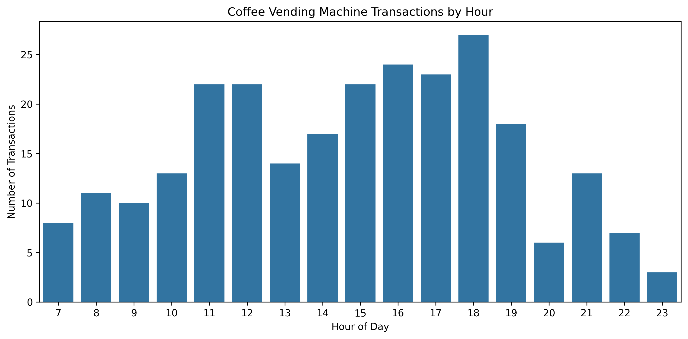
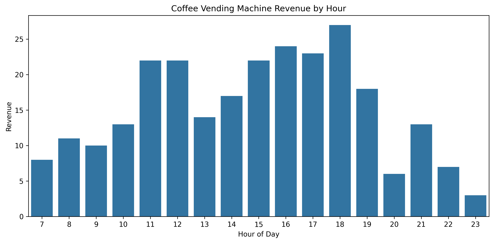
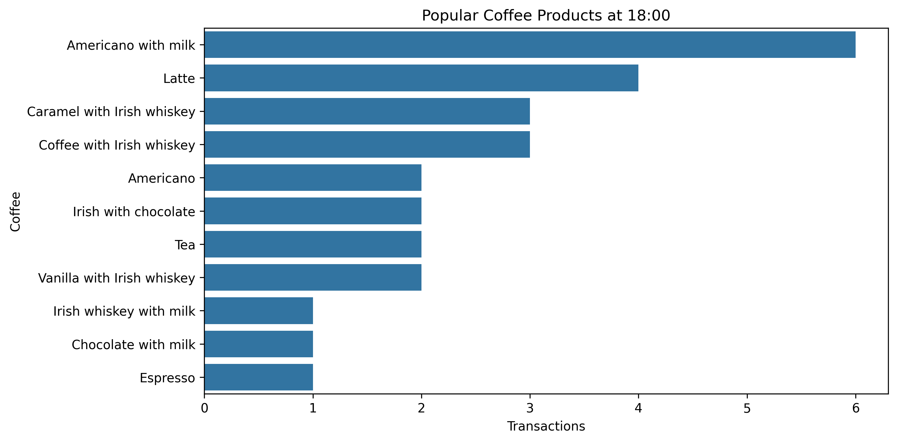

# Coffee Vending Machine Peak Hour Analysis

## 📌 Project Overview

This project analyzes coffee vending machine transaction data to identify peak sales hours and understand customer purchasing patterns throughout the day.

The analysis uses **SQL** for data querying and data aggregation, while **Python** is used for exploratory data analysis, data cleaning, and visualization.

---

## 🎯 Business Problem

A coffee vending machine operator needs to understand when customer demand is highest during the day.

Identifying peak hours can help the operator optimize:

- inventory availability
- restocking schedules
- machine maintenance
- operational planning

---

## ❓ Business Questions

1. What are the busiest hours based on transaction volume?
2. What are the highest-revenue hours?
3. Are the peak transaction hours consistent with peak revenue hours?
4. Which coffee products are most popular during peak hours?
5. What operational recommendations can be made based on the findings?

---

## 📊 Dataset

The dataset contains coffee vending machine transaction records. The data set can be accessed via [Kaggle](https://www.kaggle.com/datasets/ihelon/coffee-sales).

| Column | Description |
|---|---|
| `date` | Transaction date |
| `datetime` | Transaction date and time |
| `cash_type` | Payment method |
| `money` | Transaction amount |
| `coffee_name` | Coffee product purchased |

---

## 🛠️ Tools & Technologies

- SQL (SQLite)
- Python (Pandas, Matplotlib, Seaborn)

---

## 🔍 Analysis Approach

### 1. Data Preparation

- Check data types
- Check missing values
- Check duplicate records
- Extract transaction hour from `datetime`

### 2. SQL Analysis

SQL is used to calculate:

- transactions by hour
- revenue by hour
- average transaction value
- peak transaction hour
- peak revenue hour
- popular products during peak hours

### 3. Python Analysis

Python is used for:

- exploratory data analysis
- visualization

---

## 📈 Key Findings

### Peak Transaction Hour

> The highest transaction volume occurred at **18:00**, indicating strong demand during the evening period.

### Peak Revenue Hour

> The highest revenue was generated at **18:00**, consistent with the transaction-volume pattern.

### Popular Product During Peak Hour

> **Americano with Milk** was the most frequently purchased coffee during the peak period.

---

## 💡 Business Recommendations

1. Increase inventory availability before peak hours.
2. Schedule restocking in the morning (07.00 - 10.00) or night after 19.00.
3. Schedule non-critical machine maintenance outside peak hours.
4. Monitor peak-hour demand regularly to improve inventory planning.

---

## 📊 Visualizations

### Transactions by Hour

### Revenue by Hour

### Popular Products During Peak Hours

---

## 📌 Conclusion

The analysis identifies the periods with the highest customer activity and revenue throughout the day.

The findings can be used to improve vending machine inventory management, restocking schedules, and operational planning.

---

## 👤 Author

Arya Bima Sena

Aspiring Data Analyst
